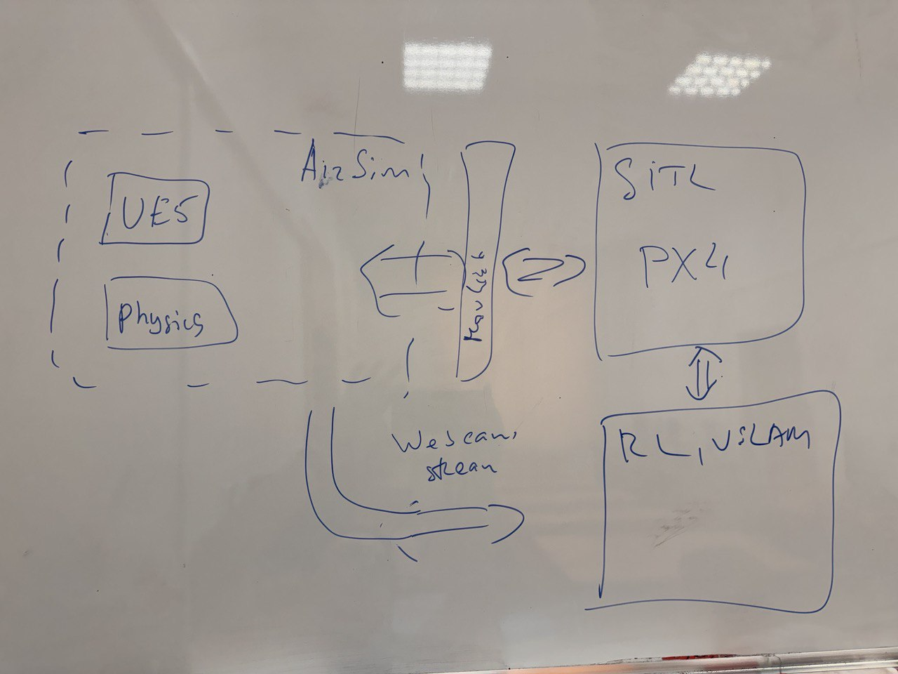

# DroneProject

## Overview

The **DroneProject** is a Robotics class project focused on creating a drone that can automatically find a landing spot and land safely.

<u>CLICK ON VIDEO TO WATCH</u>

## Achievements

- **Autonomous Takeoff**: The drone can take off and hold a given altitude.
- **Circle Tracking**: The drone detects a moving circle on the ground and adjusts its position to stay above it at given altitude.
- **Camera Stabilization**: The camera on the drone stabilizes itself to compensate for the drone’s orientation, ensuring clear and steady footage.

## Future Goals

- **Deep Learning**: We plan to use deep learning to improve object detection and help the drone make better decisions.
- **Improved AI for Piloting**: The goal is to improve the drone’s brain using neural networks for smarter flight and landing control.

## Architecture

The system uses a combination of the following technologies:

- **Unreal Engine 4.27**: A 3D engine used to create realistic simulation environments for testing the drone.
- **AirSim**: A simulator that allows us to test drone behavior in Unreal Engine.
- **PX4**: Open-source flight control software that handles the drone’s flight and navigation.
- **MAVSDK**: A tool to communicate with the drone and send commands like takeoff and landing.
- **OpenCV**: A computer vision library used to process images and track objects like the moving circle.
                                                      
